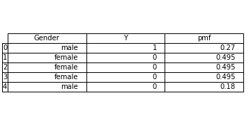
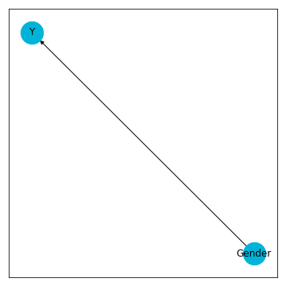

# fake-data-for-learning

Interesting fake multivariate data is harder to generate than it should be. Textbooks typically give definitions, two standard examples (multinomial and multivariate normal) and then proceed to proving theorems and propositions. True, one dimensional distributions can be combined, but here as well the source of examples is also sparse, e.g. products of distributions or copulas (typically Gaussian or t-copulas) applied to these 1-d examples.

For machine learning experimentation, it is useful to have an unlimited supply of interesting fake data, where by interesting I mean that we know certain properties of the data and want to test if the algorithm can pick this up. A great potential source of such data is graphical models.

The goal of this package is to make it easy to generate interesting fake data. In the current release, we generate fake data with discrete Bayesian networks (also known as directed graphical models).

* **Website**: [https://munichpavel.github.io/fake-data-for-learning](https://munichpavel.github.io/fake-data-for-learning)
* **Documentation**: [https://munichpavel.github.io/fake-data-docs/](https://munichpavel.github.io/fake-data-docs/)
* **Installation**: [docs/source/install.rst](docs/source/install.rst)

## Basic usage

The methods and interfaces for `fake_data_for_learning` largely follow those of [scipy](https://scipy.org), e.g. the method `rvs` to generate random samples, and `pmf` for the probability mass function, with extensions to handle non-integer sample values.

Defining and sampling from (discrete) conditional random variables:

```python
import numpy as np
from fake_data_for_learning import BayesianNodeRV, SampleValue

# Gender -> Y
# Define Gender with probability table, node label and value labels
Gender = BayesianNodeRV('Gender', np.array([0.55, 0.45]), values=['female', 'male'])

# Define Y with conditional probability table, node, value and parent labels
pt_YcGender = np.array([
    [0.9, 0.1],
    [0.4, 0.6],
])
Y = BayesianNodeRV('Y', pt_YcGender, parent_names=['Gender'])

# Evaluate probability mass function for given parent values
Y.pmf(0, parent_values={'Gender': SampleValue('male', label_encoder=Gender.label_encoder)})
# 0.4

# Sample from Y given Gender
Y.rvs({'Gender': SampleValue('male', label_encoder=Gender.label_encoder)}, seed=42)
# array([0])
```

Combine into a Bayesian network. Sample and calculate the probability mass function of each sample.

```python
from fake_data_for_learning import FakeDataBayesianNetwork
samples = bn.rvs(size=5)
# Rounding of pmf is only for display purposes
samples['pmf'] = samples[['Gender', 'Y']].apply(lambda sample: round(bn.pmf(sample), 3), axis=1)
```



Visualize the Bayesian network

```python
bn.draw_graph()
```



See the demo notebook [notebooks/bayesian-network.ipynb](notebooks/bayesian-network.ipynb) for feature examples.

To avoid having to enter all each value of a conditional probability array, there are also two methods to generate random conditional probability tables.

The method `fake_data_for_learning.utils.RandomCpt()` gives a random conditional probability table, but if you want to constrain the entries to satisfy constraints on expectation values, this is done in the class `fake_data_for_learning.utils.ProbabilityPolytope`; see the example notebook [notebooks/conditional-probability-tables-with-constraints.ipynb](notebooks/conditional-probability-tables-with-constraints.ipynb).

## Installation

See the [installation instructions](docs/source/install.rst).

Note that the methods of `utils.ProbabilityPolytope` that use polytope calculatations to generate conditional probability tables subject to constraints on expectation value uses the non-pure-python library [pypoman](https://github.com/stephane-caron/pypoman). See the [installation instructions](https://github.com/stephane-caron/pypoman#installation) for external dependencies.

## Related packages

This package exists because I became tired of googling for existing implementations of how I wanted to generate fake data. In the development process, however, I found other packages for generating interesting fake data, notably

* [pyro](https://pyro.ai/) is convenient for generating a wide variety of interesting fake data. It is easy to generate fake data from Bayesian networks joined by link functions; see e.g. [the introductory tutorial](http://pyro.ai/examples/intro_part_i.html).

* [pgmpy](http://pgmpy.org/index.html) has a large amount of overlapping functionality, noting that `pgmpy` has a significantly larger scope. One difference is the bookkeeping convention for conditional probability tables: `pgmpy` represents conditional probability tables as 2d matrices, whereas we give each of the *n*-1 conditioned variables its own dimension, resulting in an *n* dimensional matrix.

* [pyagrum](https://pyagrum.readthedocs.io) is a Python wrapper around the C++ library [aGrUM](http://agrum.org/), and has similar funcionality with a larger scope. Unlike `pgmpy`, `pyagrum` has a similar API for specifying conditional probability tables to the one used here.

* [causalgraphicalmodels](https://github.com/ijmbarr/causalgraphicalmodels)'s class `StructuralCausalModel` allows sampling from Bayesian network where the variables are related as functions of one another, rather than via the conditional probability tables used here.
